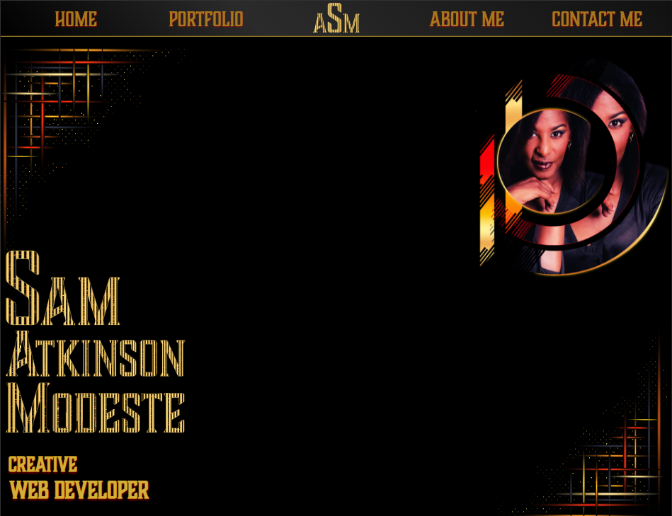

# Treehouse FEWD TechDegree - Portfolio

This is my ninth and final project for the [Front End Web Development Techdegree at Treehouse](https://teamtreehouse.com/techdegree/front-end-web-development).

### Description

A portfolio of projects created during my journey of Treehouse's FEWD Techdegree.

## Table of contents

- [Overview](#overview)
  - [About this project](#about-this-project)
  - [Screenshot](#screenshot)
  - [Link](#links)
- [Process](#my-process)
  - [Technologies used](#technologies-used)
  - [What I learned](#what-i-learned)
  - [Continued development](#continued-development)
- [Author](#author)
- [Acknowledgments](#acknowledgments)

## Overview

### About this project

### Screenshot of my home section of my portfolio

**Using all the knowledge I have learnt throughout my techdegree, I have gone through the process of creating a mockup and then bringing the mockup to life through code.**

Users should be able to:

- A mobile-first approach is utilized using min-width properties for media queries.
- Click through a carousel of my projects
- Learn a little about myself

#### Exceeds Requiremnts

- **Exceeds**: Add another breakpoint for tablet sized screens..
- **Exceeds**: Links to more than 4 projects.
- **Exceeds**: Use SVG images for icons.
- **Exceeds**: More than one example of JavaScript interactivity, that is triggered by an event.

### Live Link

- Live Site URL: [Project 8 Awesome Employee Directory](https://samatkinsonmodeste.github.io/Project-8-API-Employee-Directory/)

## My Process

As I wanted to create my own **SVG**s, I started experimenting with Illustrator. 
I moved on to creating mockups of mobile,tablet and desktop in Adobe XD. 
For the coding process I followed my mockups and with Adobe XD able to gain some of the code for fonts and colours. 😀

### Technologies Used

- Semantic HTML5 markup
- CSS Grid
- CSS Flexbox
- SVG
- JavaScript
- [GSAP](https://gsap.com/) - Javascript Animation library
- Illustrator
- Photoshop
- Adobe XD
- Favicon [Favicon Generator](https://www.favicon-generator.org/) - The Favicon Generator App where I upload my created favicon

### What I Learned

I gained a better understanding of _CSS Grid_ and more confidence with _JavaScript_.
I learnt that for my _GSAP_ animation to run, I had to add the values in quote marks so my animation ran with every click.

### Continued Development

Learning and using a Javascript framework such as React.

## Author

- Team Treehouse - [samanthaatkinson](https://www.teamtreehouse.com/samanthaatkinson)
- Twitter - [@sammodeste1](https://www.twitter.com/@sammodeste1)
- LinkedIn - [sam-atkinson-modeste](https://www.linkedin.com/<<sam-atkinson-modeste>>)
- GitHub - [SamAtkinsonModeste](https://www.github.com/SamAtkinsonModeste)

## Acknowledgments

- [Brian Jensen](https://teamtreehouse.com/brianjensen) at Treehouse has always encouraged, supported me and cheered me on through out my journey.

- [Rohlad von Merode](https://teamtreehouse.com/rohald89) also at Treehouse introduced me to GSAP , which I so love. He has been my soundboard for many things and a great support. Very grateful to all he has done for me.

Hopefully I have made them both proud with my portfolio.
